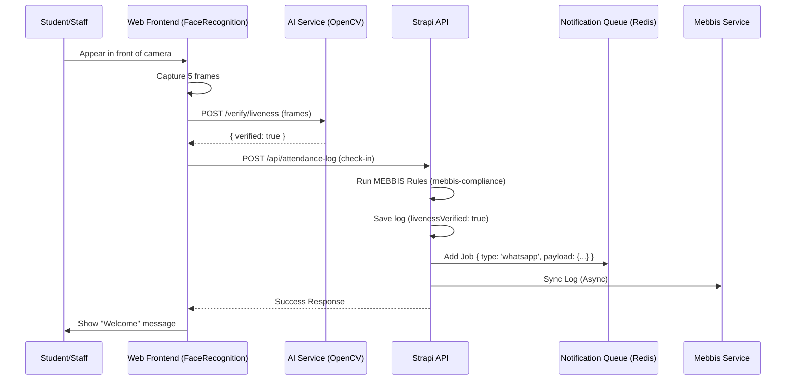

# Design: Attendance V2 (BKDS Compliance & Biometric Reliability)

## 1. Overview
Attendance V2 aims to eliminate biometric spoofing and automate regulatory compliance through two core technical systems:
1. **Biometric Liveness Engine:** A multi-frame analysis system to detect physical presence.
2. **Asynchronous Notification Hub:** A robust, template-based messaging system for real-time parent alerts.

## 2. Biometric Liveness Engine

### 2.1. AI Service (Python/OpenCV)
We will extend the `FaceService` to analyze a sequence of frames rather than a single image.

- **Endpoint:** `POST /verify/liveness`
- **Input:** Multipart form-data with a list of 3-5 consecutive JPEG frames.
- **Logic:**
    - **EAR (Eye Aspect Ratio):** Detect blink patterns across frames.
    - **Landmark Variance:** Measure subtle head movements or micro-expressions to distinguish a human from a static photo.
- **Output:** `{ verified: boolean, liveness_score: float, faces_detected: number }`

### 2.2. Frontend (React)
- **Capture Logic:** When a face is detected with >0.8 confidence, the `FaceRecognition` component will buffer 5 frames over 1 second.
- **State Machine:**
    - `IDLE` -> `DETECTED` (Start buffering) -> `VERIFYING_LIVENESS` (Call AI Service) -> `RECOGNIZING` (Identify student) -> `SUCCESS`.

## 3. Notification Hub

### 3.1. Infrastructure
We will use **BullMQ** with a shared **Redis** instance to handle notifications asynchronously.

- **Queue Name:** `attendance-notifications`
- **Producer:** Strapi `attendance-log` lifecycle hooks.
- **Consumer:** A dedicated Node.js worker (existing `web/scripts/worker.ts` will be expanded or a new one created in Strapi).

### 3.2. WhatsApp Integration
- **Service:** `strapi/src/api/notification-hub/services/whatsapp.ts`
- **Provider:** WhatsApp Business API (via Cloud API or Twilio).
- **Template System:**
    - Content Type: `notification-template`
    - Attributes: `name` (UID), `body` (Text with placeholders like `{{student}}`, `{{time}}`).

### 3.3. Sync Conflict Management
- **Content Type:** `attendance-sync-issue`
- **Attributes:**
    - `logId` (Relation to attendance-log)
    - `type` (Enum: `MEBBIS_ERROR`, `NETWORK_FAILURE`, `DATA_MISMATCH`)
    - `resolved` (Boolean)
    - `errorMessage` (Text)

## 4. Database Changes

### 4.1. `attendance-log` (Existing)
- Add `livenessVerified` (Boolean, default: false).
- Add `mebbisSyncStatus` (Enum: `synced`, `pending`, `failed`).
- Add `mebbisSyncId` (String, nullable).

## 5. Sequence Diagram (Attendance Flow)

## 6. Security & Privacy (KVKK)
- No video or raw image sequences will be stored in the database.
- Frames are processed in memory by the AI Service and discarded immediately after liveness calculation.
- Only the `liveness_score` and `verified` flag are persisted for audit trails.
