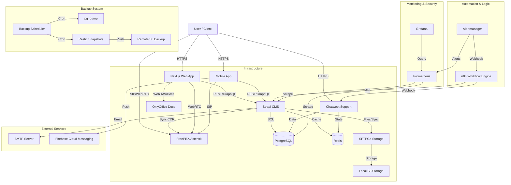

# System Architecture

## Overview

Arkadaş ERP is a comprehensive solution for Special Education and Rehabilitation Centers. It is built using a modern decoupled architecture with Strapi as the Headless CMS/Backend and Next.js as the frontend.

## High-Level Architecture

## Core Components

### 1. Frontend (Web)
- **Framework:** Next.js (React)
- **Styling:** Tailwind CSS + Custom CSS
- **State Management:** React Query / Context API
- **Authentication:** Custom JWT Implementation (HTTP-Only Cookie)

### 2. Backend (Strapi)
- **Framework:** Strapi (Node.js)
- **Database:** PostgreSQL
- **Caching:** Redis
- **Content Types:**
  - Students, Personnel, Parents
  - Reports, Training Plans
  - Calendar Events

### 3. File Storage (SFTPGo)
- **Protocol:** SFTP / WebDAV
- **Integration:** Custom Strapi Provider
- **Features:**
  - Secure file upload/download
  - User-based quota management
  - WebDAV support for OnlyOffice

### 4. Document Editing (OnlyOffice)
- **Integration:** Embedded in Web App
- **Features:** Real-time collaboration, Office format support

### 5. Communication (PBX)
- **Engine:** FreePBX / Asterisk
- **Protocol:** SIP, WebRTC
- **Features:** Voice calls, IVR, Call recordings
- **Integration:** WebRTC dialer in Frontend, CDR sync to Strapi

### 6. Automation & Messaging (Phase 6)
- **n8n:** Low-code workflow automation tool. Acts as the central nervous system, routing alerts and synchronizing data between services.
- **Chatwoot:** Open-source customer engagement suite. Handles internal communication and support tickets, replacing Slack.

### 6. Monitoring & Observability
- **Metrics:** Prometheus
- **Visualization:** Grafana
- **Alerting:** Alertmanager (Routes to n8n)
- **Logs:** Loki & Promtail
- **Security:** Docker Scout

### 7. Backup & Recovery
- **Scheduler:** Dockerized Cron service running daily backups.
- **Strategy:** Full dumps of Database, Redis, and File uploads.
- **Offsite:** Restic integration for encrypted, deduplicated backups to S3/Cloud storage.

## Data Flow

### Authentication Flow
1. User submits credentials to Web App.
2. Web App calls Strapi authentication endpoint.
3. Strapi validates against PostgreSQL.
4. Strapi returns JWT.
5. Web App stores JWT in HTTP-only cookie (via NextAuth).

### File Upload Flow
1. User selects file in Web App.
2. Web App sends file to Strapi Upload API.
3. Strapi streams file to SFTPGo via SFTP protocol.
4. SFTPGo stores file on disk/S3.
5. Strapi records file metadata in PostgreSQL.

## Infrastructure

- **Docker Compose:** Orchestrates all services.
- **Networks:** Isolated internal network for backend services.
- **Volumes:** Persistent storage for DB, Redis, and Files.

## Security

- **JWT:** Used for API authentication.
- **Role-Based Access Control (RBAC):** Strapi internal permissions.
- **Input Validation:** Zod schema validation.
- **Rate Limiting:** Managed by Strapi and Traefik (optional).
