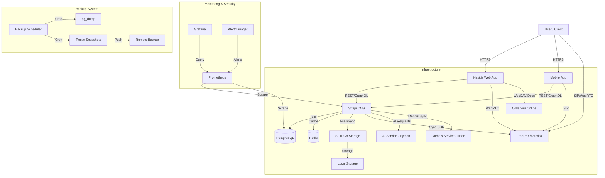

# System Architecture

## Overview

Arkadaş ERP is a comprehensive solution for Special Education and Rehabilitation Centers. It is built using a modern decoupled architecture with Strapi as the Headless CMS/Backend and Next.js as the frontend.

## High-Level Architecture

## Core Components

### 1. Frontend (Web)
- **Framework:** Next.js 16 (React 19)
- **Styling:** Tailwind CSS + Lucide React
- **State Management:** React Query / Context API
- **Authentication:** Custom JWT Implementation (HTTP-Only Cookie)

### 2. Backend (Strapi)
- **Framework:** Strapi v5 (Node.js)
- **Database:** PostgreSQL 15 + pgvector
- **Caching:** Redis 7
- **Integration:** Central hub for all external services (AI, Mebbis, SFTPGo).

### 3. AI & Computer Vision (api/opencv)
- **Stack:** Python 3.13, OpenCV, FastAPI.
- **Features:** 
  - Face recognition for attendance tracking.
  - Document processing and OCR.
  - AI-driven BEP (Bireyselleştirilmiş Eğitim Programı) generation.

### 4. Mebbis Integration
- **Stack:** Node.js (TypeScript)
- **Purpose:** Automation for MEBBİS (Ministry of National Education Information System) data entry and synchronization.

### 5. Mobile (mobile/)
- **Framework:** React Native (Expo)
- **Features:** Parent/Teacher portals, notification center, and mobile attendance.

### 6. File Storage & Document Editing
- **SFTPGo:** Secure storage backend with WebDAV support.
- **Collabora Online:** Office suite integration for real-time document editing (BEP plans, reports).

### 7. Communication (PBX)
- **Engine:** FreePBX / Asterisk
- **Protocol:** SIP, WebRTC
- **Features:** Voice calls, IVR, Call recordings
- **Integration:** WebRTC dialer in Frontend, CDR sync to Strapi

### 8. Monitoring & Observability
- **Metrics:** Prometheus
- **Visualization:** Grafana
- **Alerting:** Alertmanager
- **Security:** Docker Scout

### 9. Backup & Recovery
- **Scheduler:** Dockerized Cron service running daily backups.
- **Strategy:** Full dumps of Database, Redis, and File uploads using Restic.

## Data Flow

### Authentication Flow
1. User submits credentials to Web App.
2. Web App calls Strapi authentication endpoint.
3. Strapi validates against PostgreSQL.
4. Strapi returns JWT.
5. Web App stores JWT in HTTP-only cookie (via NextAuth).

### File Upload Flow
1. User selects file in Web App.
2. Web App sends file to Strapi Upload API.
3. Strapi streams file to SFTPGo via SFTP protocol.
4. SFTPGo stores file on disk/S3.
5. Strapi records file metadata in PostgreSQL.

## Infrastructure

- **Docker Compose:** Orchestrates all services.
- **Networks:** Isolated internal network for backend services.
- **Volumes:** Persistent storage for DB, Redis, and Files.

## Security

- **JWT:** Used for API authentication.
- **Role-Based Access Control (RBAC):** Strapi internal permissions.
- **Input Validation:** Zod schema validation.
- **Rate Limiting:** Managed by Strapi and Traefik (optional).
