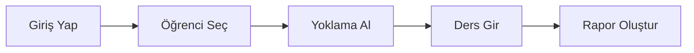

# ⚡ Hızlı Başlangıç

5 dakikada Arkadaş ERP'yi kullanmaya başlayın.

## Temel İş Akışı

## 1. Yoklama Alma (2 dk)

1. Sol menüden **Yoklama** modülünü açın
2. Bugünün tarihini seçin
3. Öğrencilerin yanındaki ✅ veya ❌ işaretlerini tıklayın
4. **Kaydet** butonuna tıklayın

## 2. Ders Kaydı (2 dk)

1. **Program** modülüne gidin
2. Dersi tıklayın
3. Dersin içeriğini yazın
4. **Tamamla** butonuna tıklayın

## 3. Rapor Görüntüleme (1 dk)

1. **Raporlar** modülüne gidin
2. Rapor türünü seçin (Yoklama, Performans, vb.)
3. Tarih aralığı belirleyin
4. **Oluştur** butonuna tıklayın

## Kısayollar

| Kısayol | İşlem |
|---------|-------|
| `Ctrl + K` | Arama |
| `Alt + Y` | Yoklama |
| `Alt + P` | Program |
| `Alt + R` | Raporlar |

## Yardım

Herhangi bir sayfada **?** simgesine tıklayarak o sayfaya özel yardım alabilirsiniz.

!!! tip "İpucu"
    Sık kullandığınız sayfaları favorilere ekleyerek hızlı erişim sağlayabilirsiniz.
